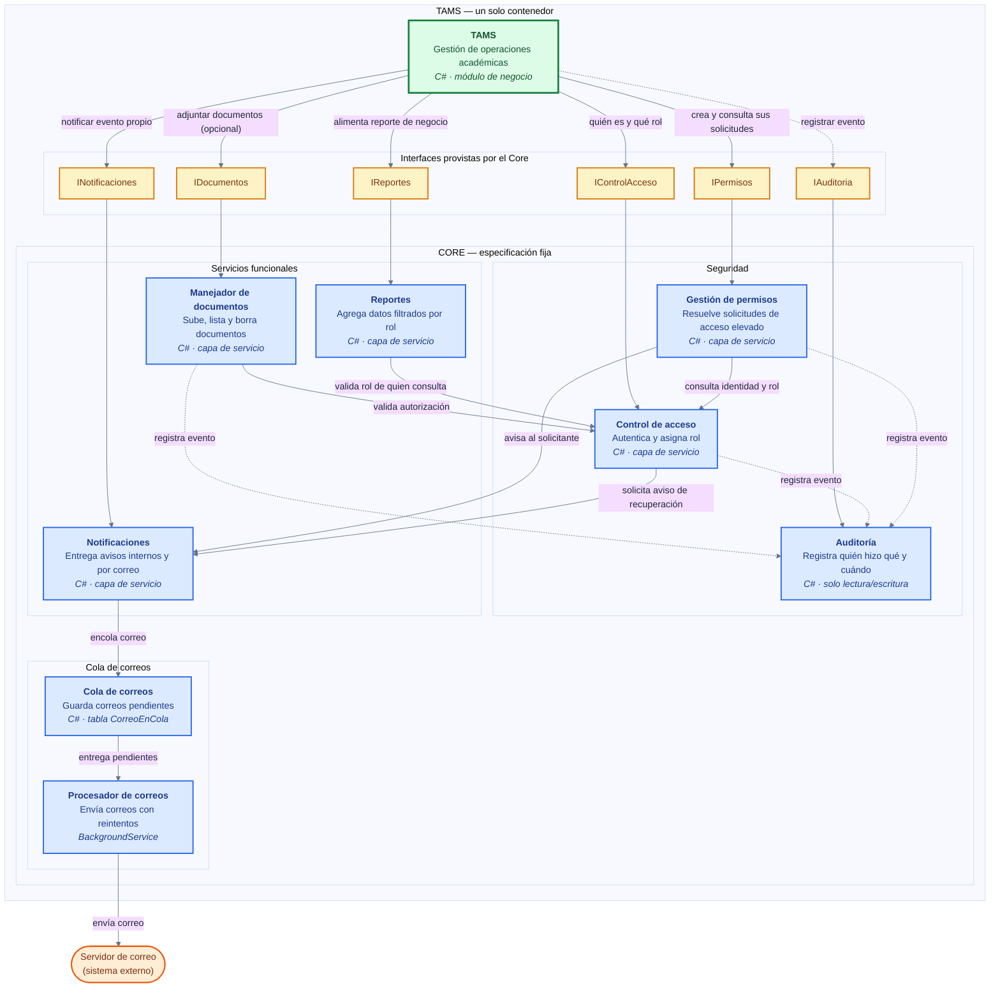

# TAMS
Sistema de Gestión Académica Docente para la administración de asignaciones, cursos, horarios y calificaciones. Proyecto de Programación III.

## Requisitos previos

- .NET SDK 10
- SQL Server (local o accesible)
- Una cuenta de Mailtrap (o cualquier servidor SMTP) para el envío de correos

## Variables de entorno

Ninguna credencial está en el repositorio (RD-10). Defínelas con:

```powershell
[System.Environment]::SetEnvironmentVariable("NOMBRE","valor","User")
```

Cierra y abre VS Code por completo después de definir o cambiar cualquiera de estas.

| Variable | Para qué sirve |
|---|---|
| `TAMS_NEGOCIO_CONNECTION_STRING` | Cadena de conexión del esquema `negocio` (módulo TAMS) |
| `TAMS_CORE_CONNECTION_STRING` | Cadena de conexión del esquema `core` (Control de acceso) |
| `TAMS_JWT_SECRETO` | Clave de firma de los tokens JWT de sesión (Base64, mínimo 32 bytes) |
| `TAMS_SMTP_HOST` | Host del servidor SMTP |
| `TAMS_SMTP_PORT` | Puerto del servidor SMTP |
| `TAMS_SMTP_USUARIO` | Usuario de autenticación SMTP |
| `TAMS_SMTP_CONTRASENA` | Contraseña o token de autenticación SMTP |
| `TAMS_SMTP_REMITENTE` | Dirección "De" con la que se envían los correos |

## Cómo arrancar el proyecto

```powershell
git clone <url-del-repo>
cd TAMS
# define las 8 variables de entorno de arriba, cierra y abre VS Code

dotnet build TAMS.slnx

# aplica las migraciones (crea las tablas si no existen)
dotnet ef database update --project src/Tams.Negocio --startup-project src/Tams.Api
dotnet ef database update --project src/Core --startup-project src/Tams.Api

cd src\Tams.Api
dotnet run

> Usa `dotnet run` (perfil `http`), no F5 desde Visual Studio: el perfil
> `https` redirige y rompe los enlaces de activación/recuperación, que
> apuntan a `http://localhost:5132`.
```

La API queda escuchando en `http://localhost:5132`.

## Crear el primer Administrador

El registro siempre crea cuentas con rol Estándar, y nadie puede autopromoverse (es una regla de diseño: así nunca se puede quedar el sistema sin Administradores por un cambio de rol accidental). Para tener el primer Administrador:

1. Regístrate normalmente: `POST /api/cuentas/registro`.
2. Procesa la cola de correos y activa la cuenta con el enlace recibido (ver abajo).
3. Asciéndela manualmente, una sola vez, con SQL:

```sql
UPDATE core.Usuarios SET Rol = 'Administrador' WHERE Correo = 'tu_correo@ejemplo.com';
```

## Procesar la cola de correos

Los correos (activación, recuperación de contraseña) nunca se envían dentro de la misma operación que los origina: se encolan en `core.CorreosEnCola` y un comando aparte los envía.

```powershell
cd src\Tams.Api
dotnet run -- procesar-correos
```

Ejecutarlo varias veces no duplica envíos (es idempotente). Se puede correr con el servidor SMTP apagado: la operación que generó el correo ya terminó bien, y el correo queda pendiente hasta que el SMTP vuelva a estar disponible.

## Cómo provocar cada criterio de aceptación

**Registro y activación**
- `POST /api/cuentas/registro` con un correo nuevo → se crea inactiva. Repetir con el mismo correo → se rechaza.
- `POST /api/cuentas/login` antes de activar → rechazado, indica cuenta inactiva.
- Procesar la cola, abrir el enlace recibido (`GET /api/cuentas/activar?codigo=...`) → activa la cuenta.
- Abrir el mismo enlace una segunda vez → se rechaza.
- `POST /api/cuentas/reenviar` con un correo que existe y con uno que no → misma respuesta en ambos casos.

**Sesión**
- `POST /api/cuentas/login` con credenciales correctas → devuelve un JWT.
- Con contraseña incorrecta y con correo inexistente → mismo mensaje de rechazo en los dos casos.
- `GET /api/cuentas/yo` sin token → 401. Con token válido → datos del usuario.
- `POST /api/cuentas/logout` y luego reusar el mismo token en `/yo` → 401 (la sesión quedó invalidada).
- 5 logins seguidos con contraseña incorrecta, luego un sexto intento (aunque la contraseña sea correcta) → rechazado, bloqueo de 15 minutos.

**Roles y administración** (requieren un token de Administrador, ver arriba)
- Con un token de Estándar, invocar `GET /api/cuentas` o `PUT /api/cuentas/{id}/rol` directamente (sin pasar por ninguna interfaz) → 403.
- `PUT /api/cuentas/{id}/rol` como Administrador, sobre otro usuario → cambia el rol.
- Un Administrador intentando cambiarse su propio rol → 409.
- `POST /api/cuentas/{id}/desactivar` → el usuario no puede iniciar sesión y su sesión abierta queda invalidada.
- Un Administrador intentando desactivarse a sí mismo → 409.
- `GET /api/cuentas` → lista sin hashes ni tokens.

**Contraseñas**
- `POST /api/cuentas/recuperacion/iniciar` con un correo que existe y con uno que no → misma respuesta.
- Procesar la cola, recibir el código, `POST /api/cuentas/recuperacion/confirmar` → cambia la contraseña. Reusar el mismo código → se rechaza.
- Login con la contraseña anterior tras confirmar → 401. Con la nueva → funciona.
- `POST /api/cuentas/{id}/restablecer` como Administrador → la contraseña anterior del usuario deja de servir de inmediato, incluso antes de que confirme un código nuevo.
- `POST /api/cuentas/cambiar-contrasena` con sesión, indicando la actual → cambia la contraseña y cierra las sesiones anteriores.

**Correo por cola**
- Apagar el acceso al SMTP (o usar credenciales inválidas) y registrar un usuario → la operación termina bien, el correo queda "Pendiente".
- Ejecutar `dotnet run -- procesar-correos` dos veces seguidas → no duplica el envío.

**Máquina de estados de negocio**
- Ver `docs/maquina-de-estados.md`: tabla de transiciones de `Calificacion`, con la transición prohibida (`Publicada → Borrador`) y el estado terminal (`Cerrada`).

## Estructura del proyecto

```
src/
  Core/              Especificación fija del curso (Control de acceso)
  Tams.Negocio/       Módulo de negocio: gestión académica
  Tams.Api/          API web, punto de entrada único
tests/
  Tests.Arquitectura/ Verifica que Core no dependa de Tams.Negocio (RD-03)
docs/
  maquina-de-estados.md
    bitacora-asignacion-1.md
  bitacora-fase0-diagrama.md
```

---

## Diagrama de componentes



### Cómo leer el diagrama

| Elemento | Significado |
|---|---|
| Recuadro verde (`TAMS`) | El módulo de negocio: tu dominio, tus entidades y tu máquina de estados. |
| Recuadros amarillos | Las interfaces que expone el Core. Es lo único que TAMS puede usar de él. |
| Recuadros azules | Las seis piezas del Core, con su responsabilidad y su tecnología. |
| Recuadro naranja (`Servidor de correo`) | Un sistema externo, fuera de la aplicación. |
| Flecha sólida (`-->`) | Una llamada directa: quien envía la flecha necesita una respuesta de quien la recibe para completar su operación. |
| Flecha punteada (`-.->`) | Un registro que no bloquea el flujo: se avisa a Auditoría, pero la operación no depende de esa respuesta. |
| Texto sobre la flecha | El propósito de esa comunicación, no el nombre técnico del método. |

No se dibuja ninguna base de datos ni volumen como componente: cada pieza
del Core guarda sus propios datos, de forma independiente y sin que otra
pieza pueda leerlos directamente (RD-01, RD-03).