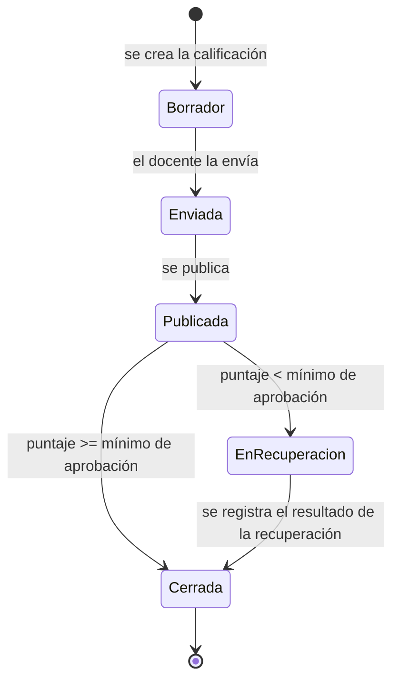

# Máquina de estados de la calificación

Bloque 5 (sección 1.6) de la Práctica 1. Este bloque es **solo estructura**: no hay
endpoints HTTP ni pruebas todavía (eso llega en bloques posteriores y en la Práctica 3).

## Dónde vive la regla

| Elemento | Ubicación |
|---|---|
| Estados | `src/Tams.Negocio/Domain/Enums/EstadoCalificacion.cs` (RF-NEG-03) |
| Transiciones permitidas | `src/Tams.Negocio/Domain/Maquinas/TransicionesCalificacion.cs` |
| Cambio de estado en la entidad | `Calificacion.CambiarEstado(...)` (delega en la máquina, no repite reglas) |
| Error de transición inválida | `src/Tams.Negocio/Domain/Excepciones/TransicionNoPermitidaExcepcion.cs` |

Las transiciones están declaradas en **un solo lugar** (RD-04): el diccionario de
`TransicionesCalificacion`. Ningún servicio ni controlador vuelve a listarlas, así que no
puede haber dos listas que se contradigan. La máquina vive en el dominio, no en el
controlador (RD-02).

## Estados

`Borrador` → `Enviada` → `Publicada` → `EnRecuperacion` → `Cerrada`

| Estado | Significado |
|---|---|
| `Borrador` | El docente está armando la calificación; todavía no se envía. Es el estado inicial. |
| `Enviada` | La calificación fue enviada y espera su publicación. |
| `Publicada` | El estudiante ya puede ver el puntaje. |
| `EnRecuperacion` | El puntaje no alcanzó el mínimo de aprobado y hay una recuperación pendiente. |
| `Cerrada` | La calificación quedó firme. **Estado terminal.** |

## Diagrama

La flecha `Publicada --> Borrador` **no** existe en el diagrama porque está prohibida.

## Transiciones permitidas

| Desde | Hacia | Quién la ejecuta | Condición |
|---|---|---|---|
| `Borrador` | `Enviada` | Docente titular de la materia | Registró el puntaje y envía la calificación. |
| `Enviada` | `Publicada` | Docente titular de la materia | La calificación se publica y queda visible para el estudiante. |
| `Publicada` | `EnRecuperacion` | Docente titular de la materia | Solo si `PuntajeObtenido` es **menor** que el mínimo de aprobación. |
| `Publicada` | `Cerrada` | Docente titular de la materia | Solo si `PuntajeObtenido` **alcanzó** el mínimo de aprobación (cierre directo, sin recuperación). |
| `EnRecuperacion` | `Cerrada` | Docente titular de la materia | Ya se registró `PuntajeRecuperacion`. |

Las dos salidas de `Publicada` son excluyentes según el mismo puntaje: o va a recuperación
o se cierra, nunca ambas.

## Transiciones prohibidas

| Desde | Hacia | Por qué |
|---|---|---|
| `Publicada` | `Borrador` | Una calificación publicada **no se despublica**: ya la vio el estudiante (RF-NEG-04). |
| `Cerrada` | cualquiera | `Cerrada` es el **estado terminal**: no hay ninguna transición de salida (RF-NEG-05). |

Además están prohibidas, porque el mapa de la máquina es exhaustivo, todas las combinaciones
que no aparecen en la tabla de permitidas: `Borrador` → `Publicada`, `EnRecuperacion` o
`Cerrada`; `Enviada` → `Borrador`, `EnRecuperacion` o `Cerrada`; `EnRecuperacion` →
`Borrador`, `Enviada` o `Publicada`; `Publicada` → `Enviada`; y cualquier salto de
`Borrador` o `Enviada` que se salte una etapa.

## Notas de implementación

- **Mínimo de aprobación:** todavía no existe configuración que lo defina, así que
  `TransicionesCalificacion.Exigir(...)` y `Calificacion.CambiarEstado(...)` lo reciben como
  parámetro. No hay un 70 fijo en el código; cuando exista la configuración, se inyectará.
- **Quién ejecuta:** en este bloque la máquina valida **estados y condiciones de puntaje**, no
  el rol de quien llama. La autorización por rol se aplicará en los servicios/endpoints, que
  consultarán los permisos del Core; por eso la columna "Quién la ejecuta" documenta el actor
  del negocio (el docente titular de la materia) y no un permiso del Core.
- **Salto de etapa:** una calificación creada en otro flujo arranca en `Borrador`
  (`CalificacionConfiguracion` lo define como valor por defecto).